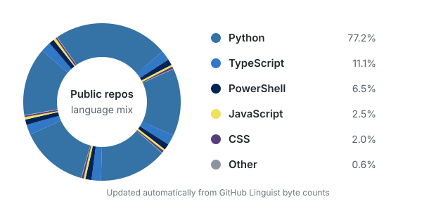

### Hi there 👋

- 📊 I study statistics and enjoy turning data into reproducible analysis and interactive products.
- 🧮 My current interests include statistical modeling, time series, machine learning, data visualization, and database engineering.
- 🛠️ I work mainly with Python, SQL, R, PostgreSQL, FastAPI, SQLAlchemy, Docker, and Linux.
- 🔍 I care about data quality, explainable analysis, system reliability, and automation.
- 📚 Beyond code, I enjoy yuri works and exploring the culture and creative ecosystem around online fiction.
- 🎧 I listen to VOCALOID music and am learning composition and arrangement.
- 🎬 I also enjoy fan creation, including Honkai: Star Rail MMD videos.
- 📫 Reach me at [ilovemiku520@outlook.com](mailto:ilovemiku520@outlook.com).

## Selected projects

- **[JJWXC Yuri Analytics](https://github.com/ilovemiku520/jjwxc-yuri-analytics)**  
  A research-oriented data platform for collecting, storing, analyzing, and visualizing public metadata about JJWXC yuri novels, authors, rankings, and daily snapshots.

- **[VCStockRank](https://github.com/ilovemiku520/VCStockRank)**  
  A cross-sectional stock-ranking and backtesting pipeline that explores temporal features and deep-learning methods for noisy financial data.

- **[Prudence Engine](https://github.com/ilovemiku520/prudence-engine)**  
  A suitability-and-intent decision system for wealth-management scenarios, combining rules, interpretable models, multiple data sources, and interactive analysis.

## Language usage

The chart is refreshed weekly from GitHub Linguist byte counts across public, non-fork repositories; it is not a measure of proficiency.

## Tools

`Python` · `SQL` · `R` · `PostgreSQL` · `NumPy` · `SciPy` · `Pandas` · `SQLAlchemy` · `FastAPI` · `Docker` · `Linux` · `Git`

## Beyond data

I enjoy moving between analytical and creative work: statistics helps me decompose difficult questions, while music, yuri works, and fan creation keep my imagination active.

> Technology keeps changing; underlying principles endure.
