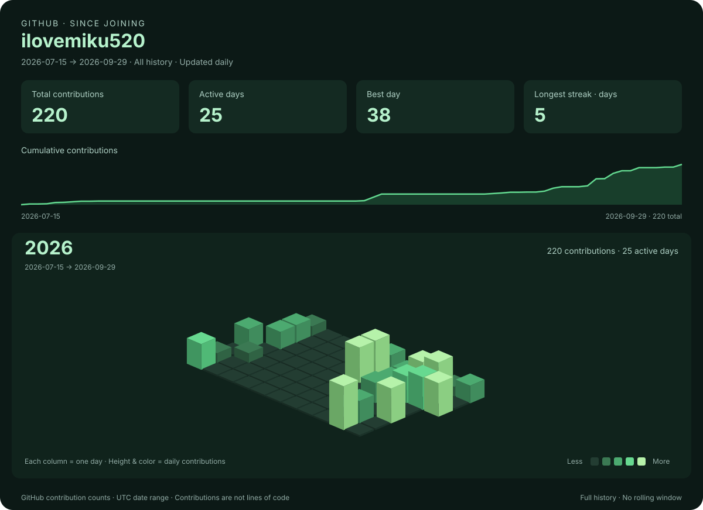

# ilovemiku520

Hi there, welcome to my profile 👋

I'm a fan of Hatsune Miku and VOCALOID, and I'm currently learning music composition and arrangement.

In my free time I enjoy survival, farming/simulation, sandbox, and collect-and-raise games — my go-tos are *Don't Starve*, *Stardew Valley*, *Minecraft*, and the *Pokémon* series.

I love Genshin Impact. Da-da-da-da-da, I really wanna play Genshin!

Feel free to reach out to talk about music, games, and the works we love.

## GitHub Contributions · Since Joining

From **July 15, 2026**, the day I joined GitHub, through the latest daily update.

The totals, cumulative trend, and 3D calendars share the same **registration-to-present** range. Previous years stay visible as new years are added. Automatically refreshed daily at approximately **02:00 China Standard Time (UTC+8)**; GitHub Actions may delay scheduled runs.

How these numbers are calculated

- Counts follow [GitHub's contribution rules](https://docs.github.com/en/account-and-profile/reference/profile-contributions-reference). They measure contributions, **not lines of code**.
- The start date is read from my account's creation time, and the end date advances on each run. Daily ranges use UTC and include the registration day and the current partial day.
- Every total and chart is derived from the same daily counts returned by GitHub. Visibility follows the workflow token's access; private activity may not be included.
- All years use the same color and height scale within each update. Column height uses a logarithmic scale to keep busy days readable.
- [Daily source data](./assets/contribution-history.json) · [Automatic update workflow](https://github.com/ilovemiku520/ilovemiku520/actions/workflows/profile-3d-contrib.yml)

## Contact

- Email: [ilovemiku520@outlook.com](mailto:ilovemiku520@outlook.com)
